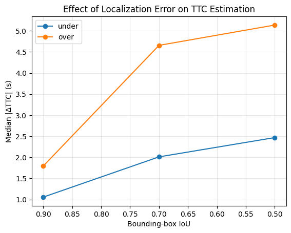
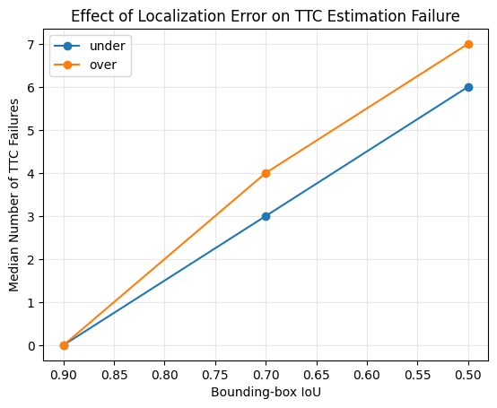

# TrafficVision-TTC
Pilot study on the impact of bounding-box localization errors on Time-to-Collision estimation in pre-collision traffic scenes.

## Overview

This pilot study investigates how bounding-box localization errors propagate to Time-to-Collision (TTC) estimation in a pre-collision traffic scene.

## Research Question

How do different magnitudes and directions of bounding-box localization errors affect trajectory-based TTC estimation?

## Dataset

Nexar Dashcam Collision Prediction Dataset and Challenge. This pilot study uses Clip 006 from the training set.

## Method

1. Detect vehicles using YOLO11.
2. Track the target vehicle using ByteTrack.
3. Extract the bounding-box trajectory.
4. Estimate image scale using:

   s(t) = sqrt(w(t) * h(t))

5. Estimate the temporal scale-change rate using a 15-frame centered rolling linear fit and compute TTC as:

   TTC(t) = s(t) / s_dot(t), for s_dot(t) > 0
   
6. Inject controlled localization errors:
   - Under-boxing
   - Over-boxing
   - IoU = 0.9, 0.7, 0.5
   - Duration = 3 frames
7. Compare perturbed TTC with baseline TTC.

## Evaluation
- Median Absolute TTC Deviation
- TTC Estimation Failure

## Preliminary Results

Increasing localization error severity generally produced larger TTC deviations and more estimation failures.

In this pilot clip, over-boxing produced larger TTC deviations than under-boxing at the same IoU level.

### TTC Absolute Deviation

### TTC Estimation Failures

## Report

[View the full pilot study report](TrafficVision_TTC_Pilot_Study.pdf)

## Limitations

This is a pilot study based on a single collision clip.
The TTC values are image-based estimates rather than physical ground-truth TTC values.

## Repository Structure

- `01_detection_tracking.ipynb` — Vehicle detection, tracking, and bounding-box trajectory extraction
- `02_ttc_baseline.ipynb` — Trajectory inspection, image-scale computation, and baseline TTC estimation
- `03_localization_error_experiment.ipynb` — Controlled localization-error injection and TTC impact evaluation
- `results/` — Experimental result figures
- `report/` — Full pilot study report
